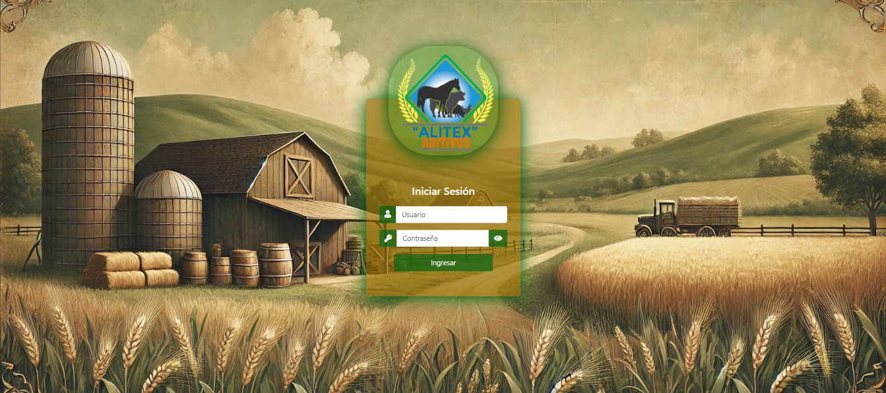
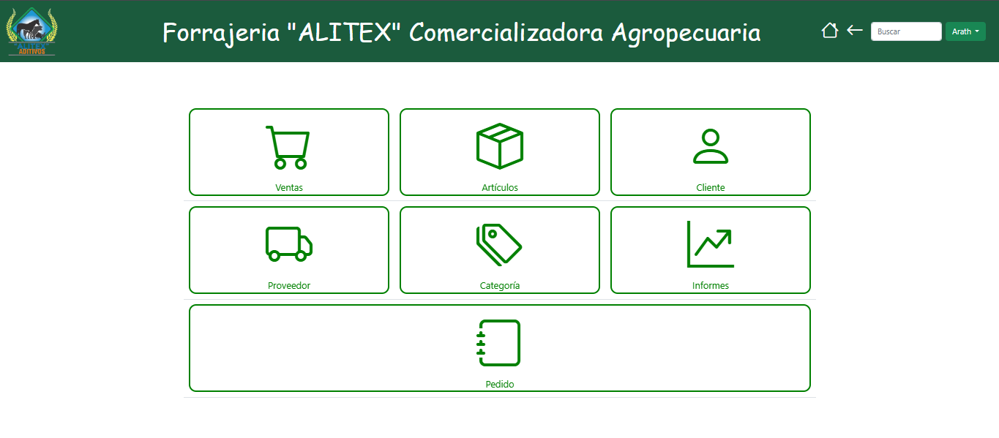
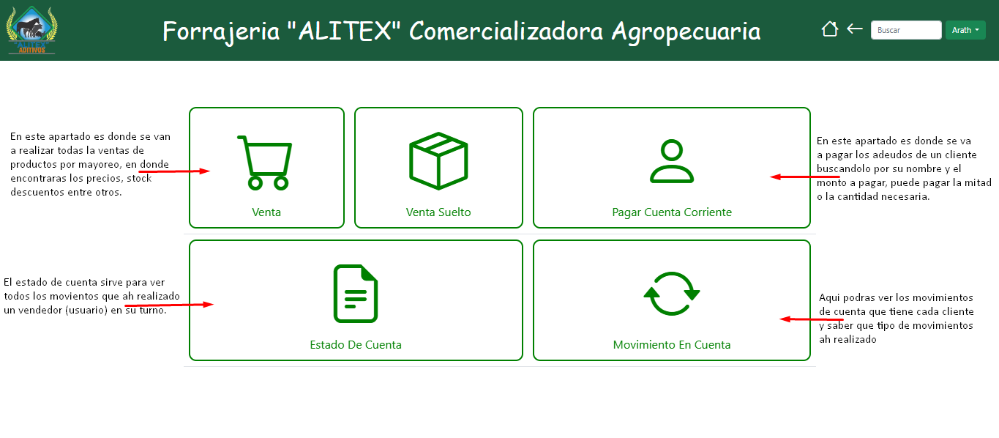
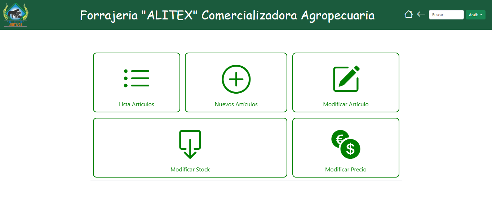
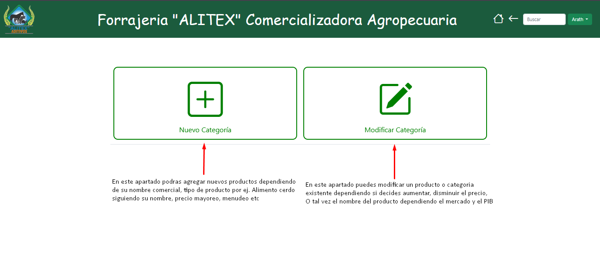
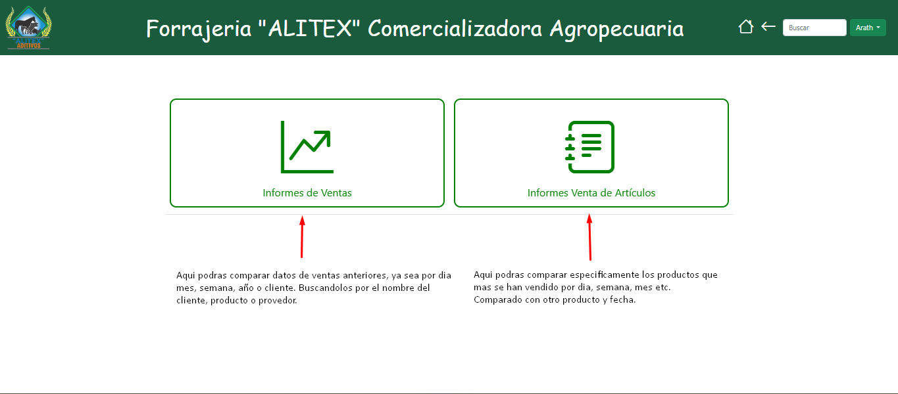
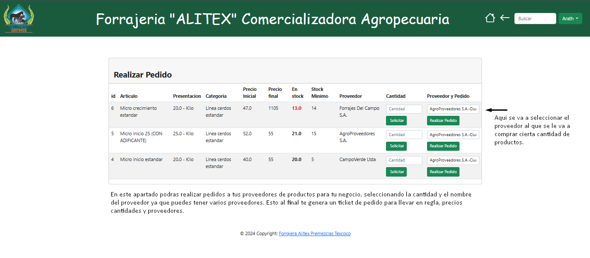
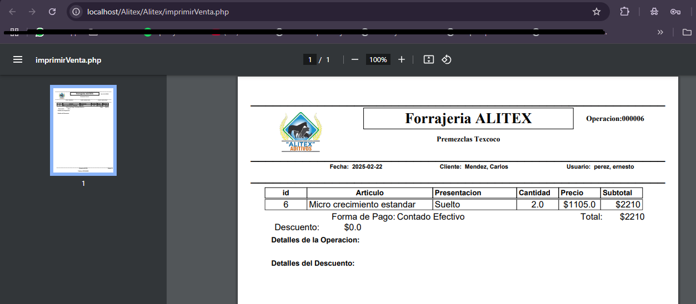
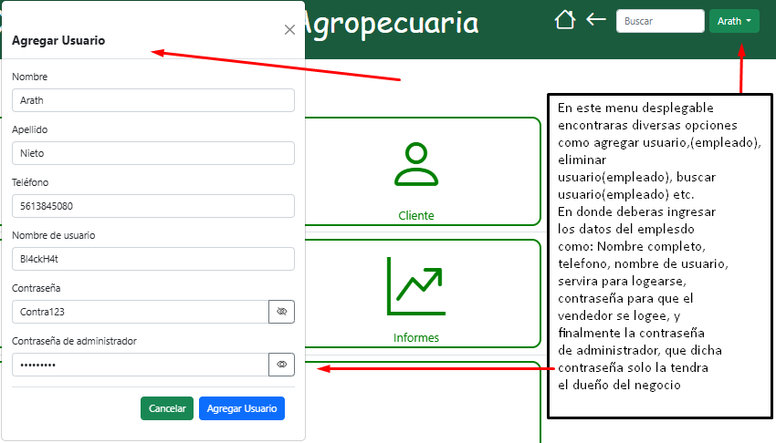

# Punto de Venta Forrajería

## Tabla de Contenidos

- [Tecnologías Utilizadas](#tecnologías-utilizadas)
- [Descripción del Proyecto](#descripción-del-proyecto)
- [Vista General del Sistema](#vista-general-del-sistema)
- [Módulos del Sistema](#módulos-del-sistema)
  - [Ventas](#1-ventas)
  - [Artículos](#2-artículos)
  - [Cliente](#3-cliente)
  - [Proveedor](#4-proveedor)
  - [Categoría](#5-categoría)
  - [Informes](#6-informes)
  - [Pedido](#7-pedido)
  - [Gestión de Usuarios](#8-gestión-de-usuarios)
- [Instalación y Uso](#instalación-y-uso)
- [Licencia y Autor](#licencia-y-autor)
- [Contacto](#contacto)


## Tecnologías Utilizadas
- **fPDF184**
- **JavaScript**
- **CSS**
- **HTML**
- **PHP**
- **HTM**
- **SQL**
- **Bootstrap**

## Descripción del Proyecto
El proyecto **Punto de Venta Forrajería** es un sistema web diseñado para gestionar las operaciones de una forrajería llamada *Alitex*. El sistema se aloja en un dominio y está restringido para el acceso exclusivo de los empleados y el dueño del local, garantizando la seguridad de la información y evitando accesos no autorizados.

Contraseña superusuario para agregar, editar eliminar empleados: Alitex12!
Usuario y contraseña de login: Arath:Contra123



## Vista General del Sistema
El siguiente diagrama muestra una visión general de los módulos integrados en el sistema:



## Módulos del Sistema

### 1. Ventas
Este módulo se encarga de gestionar las transacciones de venta y cuenta con varios subapartados:
- **Venta:** Realiza ventas al mayoreo a los clientes.
- **Venta Suelto:** Permite vender al precio comercial normal, ya sea por unidad o por kilos.
- **Pagar Cuenta Corriente:** Registra pagos parciales de adeudos. Por ejemplo, si un cliente debe $1000 y abona $500, el sistema actualiza el saldo pendiente.
- **Estado de Cuenta:** Muestra el historial de movimientos de cuenta de la empresa.
- **Movimiento en Cuenta:** Permite visualizar los movimientos de compras por cliente, producto y fecha.



Adicionalmente, en el subapartado de **Pagar Cuenta Corriente** se utiliza la siguiente imagen como referencia:


---

### 2. Artículos
Este módulo administra el inventario de productos de la forrajería. Incluye los siguientes subapartados:
- **Lista de Artículos:** Muestra todos los artículos registrados, sin importar si hay stock disponible.
- **Nuevos Artículos:** Permite agregar nuevos productos al sistema, especificando precio, modalidad de venta (por kilos, bolsas, etc.) y otros detalles.
- **Modificar Artículo:** Permite actualizar el nombre o el precio de un artículo existente.
- **Modificar Stock:** Actualiza la cantidad registrada de un artículo (por ejemplo, corregir el stock de 20 a 10 unidades).
- **Modificar Precio:** Cambia los precios de venta al mayoreo o al detalle, registrando la nueva información en la base de datos.



---

### 3. Cliente
En este módulo se gestiona la información de los clientes para llevar un control detallado de sus compras y adeudos. Se compone de:
- **Nuevo Cliente:** Registro de clientes con datos como nombre completo, teléfono, correo electrónico, dirección, localidad y estado.
- **Modificar Cliente:** Actualización de la información de un cliente.
- **Estado de Cliente:** Consulta el historial de compras y adeudos de cada cliente, facilitando un seguimiento eficiente.


---

### 4. Proveedor
El módulo de Proveedor está orientado a gestionar la información de los proveedores de la forrajería. Incluye:
- **Nuevo Proveedor:** Registro de proveedores, ingresando datos de la empresa, rubro, teléfono, correo electrónico, dirección y localidad.
- **Modificar Proveedor:** Permite actualizar los datos de un proveedor para mantener la información siempre actualizada.


---

### 5. Categoría
Este módulo organiza los productos en diferentes categorías para facilitar su identificación y gestión. Sus subapartados son:
- **Nueva Categoría:** Permite agregar un nuevo tipo de producto (por ejemplo, "alimento para cerdo").
- **Modificar Categoría:** Facilita la edición del nombre o detalles de una categoría, especificando para qué tipo de producto es.



---

### 6. Informes
El módulo de Informes genera reportes que permiten analizar el rendimiento de las ventas y el movimiento de inventario. Se divide en:
- **Informes de Venta:** Muestra reportes diarios, mensuales y generales de ventas, incluyendo detalles como cliente, tipo de venta (contado, crédito o tarjeta), descuentos aplicados, fecha y total vendido.
- **Informes de Venta de Artículos:** Permite consultar las ventas de productos individuales, segmentadas por períodos diarios, mensuales o generales.



---

### 7. Pedido
Este módulo facilita la realización de pedidos a los proveedores para reabastecer el inventario. Sus funcionalidades incluyen:
- Seleccionar el artículo y la cantidad deseada.
- Escoger el proveedor adecuado.
- Actualizar el stock automáticamente al confirmar el pedido.
- Generar e imprimir un ticket en PDF que contiene la fecha, proveedor, empleado a cargo, artículo y cantidad solicitada.



Además, se genera un ticket de venta como comprobante:



---

### 8. Gestión de Usuarios
Este módulo administra el acceso al sistema mediante la gestión de usuarios (empleados). Incluye:
- **Agregar Usuario:** Permite registrar nuevos empleados solicitando nombre y contraseña. La acción requiere la contraseña de administrador para mayor seguridad.
- **Modificar Usuario:** Permite actualizar la información de un usuario existente.
- **Buscar Usuario:** Facilita la consulta de la lista de usuarios registrados.
- **Eliminar Usuario:** Permite remover un usuario, revocando su acceso al sistema.



---

## Instalación y Uso
Para clonar y ejecutar el proyecto en tu entorno local, sigue estos pasos:

1. **Clonar el repositorio:**
   ```bash
   git clone https://github.com/ArathBl4ckH4t/punto-de-venta-forrajeria.git

2. **Acceder a la carpeta del proyecto:**
    ```bash
    cd punto-de-venta-forrajeria

3. **Configurar el servidor local:**
    Utiliza un servidor local como XAMPP o WAMP y coloca el proyecto en la carpeta correspondiente (por ejemplo, htdocs para XAMPP).

4. **Importar la base de datos:**
    Importa el archivo SQL incluido en el proyecto para crear y configurar las tablas necesarias. Llamada
    forrajeriaalitex.sql

5. **Ejecutar el proyecto:**
    Abre tu navegador y accede a la URL local donde esté alojado el proyecto para iniciar sesión y comenzar a utilizar el sistema.

## Licencia y Autor
    Este proyecto es propiedad de [Arath Nieto] y se distribuye bajo la licencia [MIT].


## Contacto

- **WhatsApp:** [+52 5613845080](https://wa.me/525613845080)
- **LinkedIn:** [Arath Nieto](https://www.linkedin.com/in/jonatan-arath-garc%C3%ADa-nieto-332698218/)
- **Portafolio:** [Visita mi portafolio](https://arathbl4ckh4t.github.io/ArathBl4ckH4t.github.io-portfolio/)


Punto de Venta Forrajería
© 2025 [ArathNieto]
